# Final Project Proposal

Group members: David Lin, Qianru Zhang, Hazel Zhang, Xianda Xu, Shiying Pan

**GitHub Repo URL**: https://github.com/CMU-IDS-Fall-2022/final-project-flight-never-delay

## Problem Description
As frequent travelers, our group members often experience flight delays. However, there is no good way for us to be informed on whether a flight will be delayed in advance. To address this problem, we would like to use data on previous flights to predict the possibility of delays for future flights.

## Question
To guide our project, we ask the following questions:
* Do delayed flights share some common factors? If so, what are the factors that serve as the main causes of flight delays?
* Given a set of factors, can we predict whether a flight is likely to be delayed? This may serve as a recommendation system for buying tickets.

## Proposed Solution
To address our problem, we aim to build a prediction model and various visualization components.
* Modelling
	* We plan to explore training ML models such as logistic regression or decision trees to predict flight delay probabilities and its potential delay time given flight details from the user.
* Visualizations
	* We plan to create a geographical map to visualize delayed routes. This visualization may reveal patterns such as frequently delayed routes.
	* We plan to create correlation charts between various variables such as departure/destination airport, weather, airline company, etc. This visualization may reveal the importance of various factors and their correlations and dependencies.

## Scope
We plan to split our project evenly between our group members. The main components of this project include:
* Cleaning the dataset (see Appendix).
* Building various flight delay prediction models and analyzing their performances.
* Creating the visualizations, such as the geographical map and various types of correlation graphs. We plan to use Altair.
* Building the frontend interface to handle user interaction and display the visualizations. We plan to use Streamlit.

### Appendix
We plan to use the [Bureau of Transportation Statistics - On-Time : Marketing Carrier On-Time Performance dataset](https://www.transtats.bts.gov/DL_SelectFields.aspx?gnoyr_VQ=FGK&QO_fu146_anzr=b0-gvzr) for our project. The dataset contains many millions data points of flight delays from January 2018 to August 2022 in the US. Each data points contains detailed information such as flight date, airline, origin/destination airport, distance between airports, and delay time (including carrier delay, weather delay, security delay, etc.).

## Sketches and Data Analysis
### Data Processing

**Data Cleaning**
Our dataset of flight delays is from the [Bureau of Transportation Statistics - On-Time : Marketing Carrier On-Time Performance dataset](https://www.transtats.bts.gov/DL_SelectFields.aspx?gnoyr_VQ=FGK&QO_fu146_anzr=b0-gvzr). The full dataset is very large (many millions of data points) - spanning from January 2018 to August 2022 with over 100 fields. For the purpose of this project, we select a subset of the data from January 2021 to December 2021 and include only 23 fields. The 23 fields are:
* Time information (YEAR, QUARTER, MONTH, DAY_OF_MONTH, DAY_OF_WEEK) - We include this to uncover correlations between time and flight delays. We also hypothesize that day of the week (e.g. Monday) will influence flight delays.
* Flight carrier (OP_UNIQUE_CARRIER, OP_CARRIER_FL_NUM) - We include this to uncover correlations between flight carriers (e.g. United Airlines) and flight delays.
* Location information (ORIGIN, DEST, DISTANCE) - We include this to uncover correlations between location/distance and flight delays.
* Flight times, delays, and reasons (CRS_DEP_TIME, DEP_TIME, DEP_DELAY, CRS_ARR_TIME, ARR_TIME, ARR_DELAY, CARRIER_DELAY, WEATHER_DELAY, NAS_DELAY, SECURITY_DELAY, LATE_AIRCRAFT_DELAY) - We include this to measure whether a flight is delayed and the degree that it was delayed for. We also include the reasons behind the delays (e.g. weather) to see if they have correlations with other fields (e.g. location).
* Cancellations and reasons (CANCELLED, CANCELLATION_CODE) - Like delays and reasons, we include similar attributes for cancellations.

Our uncleaned dataset contains 6,311,871 data points.

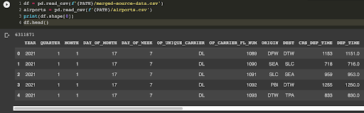

For data processing, we first drop duplicates and remove data points that contain empty fields. Then, we separate flights that are delayed and cancelled. For delayed flights, we data points that do not have a delay reason (e.g. one of CARRIER_DELAY, WEATHER_DELAY, NAS_DELAY, SECURITY_DELAY, LATE_AIRCRAFT_DELAY). For canceled flights, we similarly remove data points that do not have a cancellation reason (CANCELLATION_CODE).

We also augment our dataset with more fine-grained geographic information as we would like to create a geographic map to visualize the flight delays. Therefore, we map airport location (ORIGIN, DEST) to US state names and coordinates (latitude and longitude) from a [Kaggle dataset](https://www.kaggle.com/datasets/usdot/flight-delays?select=airports.csv). This adds 6 more fields to our dataset (ORIGIN_STATE, ORIGIN_LAT, ORIGIN_LONG, DEST_STATE, DEST_LAT, DEST_LONG). We remove data points that include airports with unknown geographical locations.

Our final dataset contains 1,141,693 data points with 29 fields.
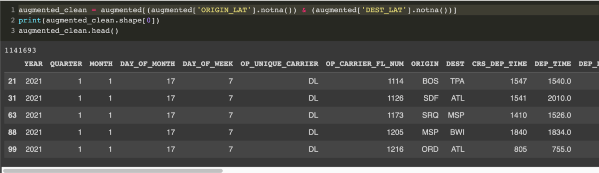

**Data analysis/exploration**

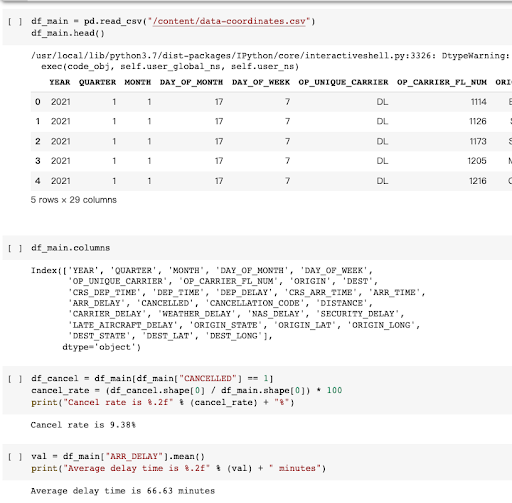

We explored the relationship between DEP_DELAY and factors including MONTH, DAY_OF_MONTH, DAY_OF_WEEK, OP_UNIQUE_CARRIER, ORIGIN, DEST, DEP_TIME, and DISTANCE.
These explorations provide us with the following inspirations:

* Divide the DEP_DELAY(delay time) into different intervals as there are too many data points, which is hard for us to tell the correlations. 

* Instead of using scatter plots, we probably need to use binned scatter points to better display the distribution of the dataset.

* When exploring relationships between ORIGIN (departure location) and DEP_DELAY, it makes more sense to use a map.

* Meanwhile, we find that aside from the number of flights, the percentage of flights(delayed flights/all flights) is also important, as some big hubs might have more flights and therefore have more delays, but that doesn’t mean you have a higher chance of delay when you depart from this city.

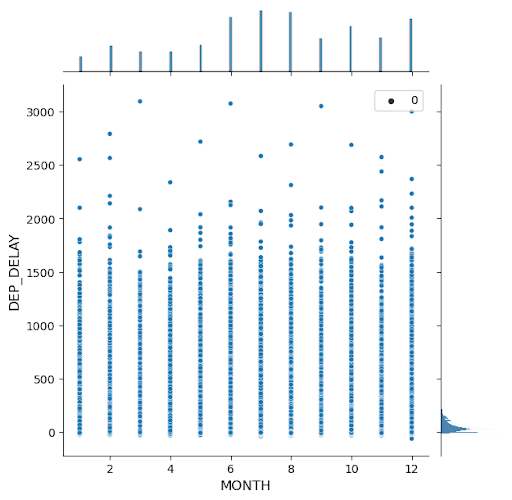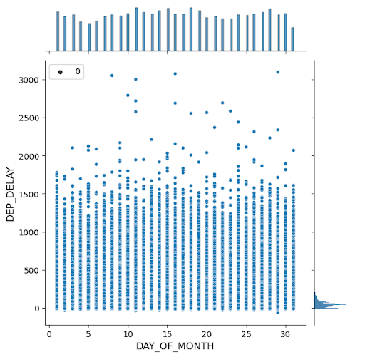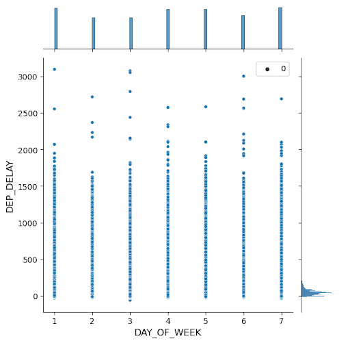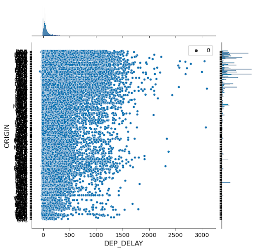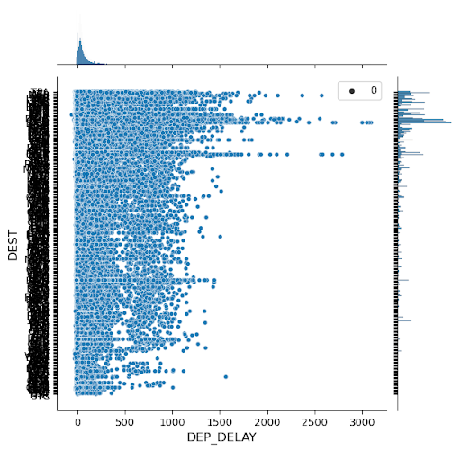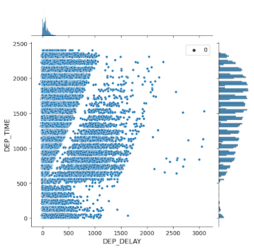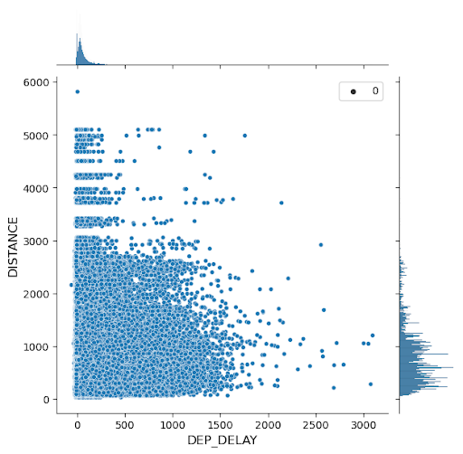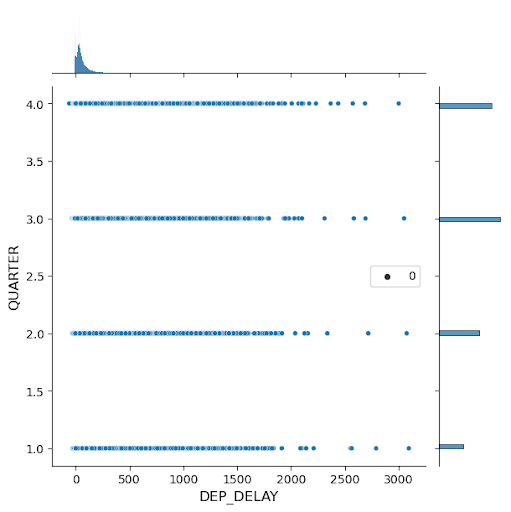

### System Sketch
We selected some of the features we thought would be helpful for future delay prediction and would like to sketch their relationship with delay time in our current dataset.

#### Data visualization
**Airline Company**

We first compared the delay time in a box plot and identified the delay time could be categorized into <20min, 20-60min, and >60min. If it is smaller than 20, it is approximately on time. If it is between 20 and 60, it is a small delay that most people can tolerate. If it is bigger than 60, the flight encounters a serious delay.

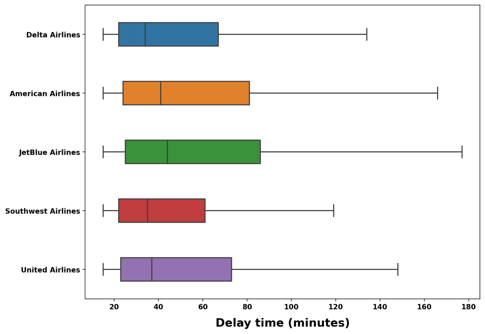

With the new categories of delay, it is easy to observe that the proportion of delays varies from airline to airline. Some airlines like JetBlue Airlines behave badly. They have a relatively low on-time rate and a relatively high large delay rate. Although Southwest Airlines has the largest number of flight delays, these delays are mainly small delays and the company maintains a pretty good on-time rate.

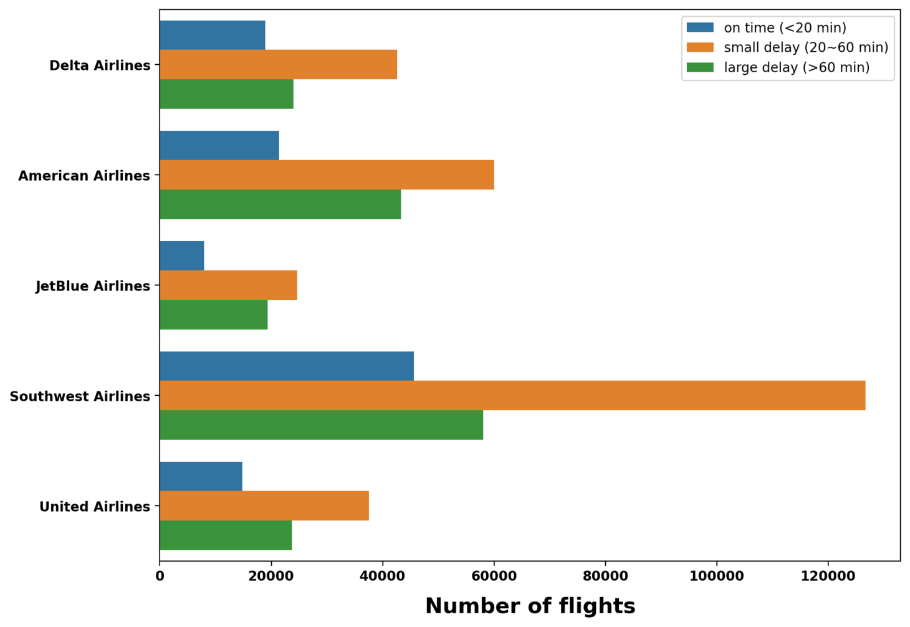

**Flight Time**

We would like to sketch a box plot for identifying the relationship between DEP_DELAY and MONTH/DAY_OF_MONTH/DAY_OF_WEEK. Users could switch between time scales through button.

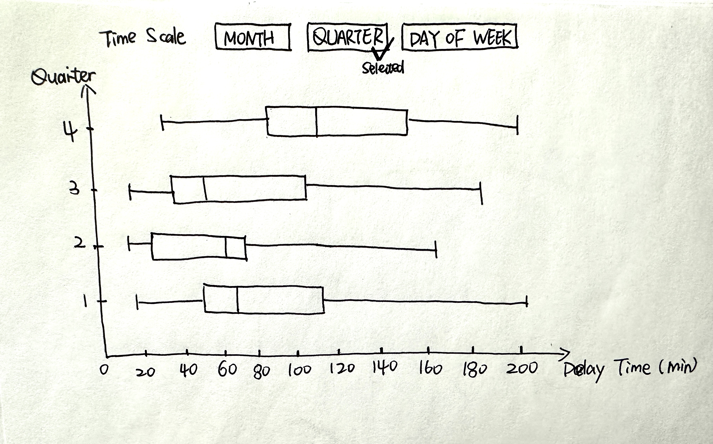

**Flight Distance**

We would like to sketch a binned scattered plot for identifying the relationship between DEP_DELAY and DISTANCE. 

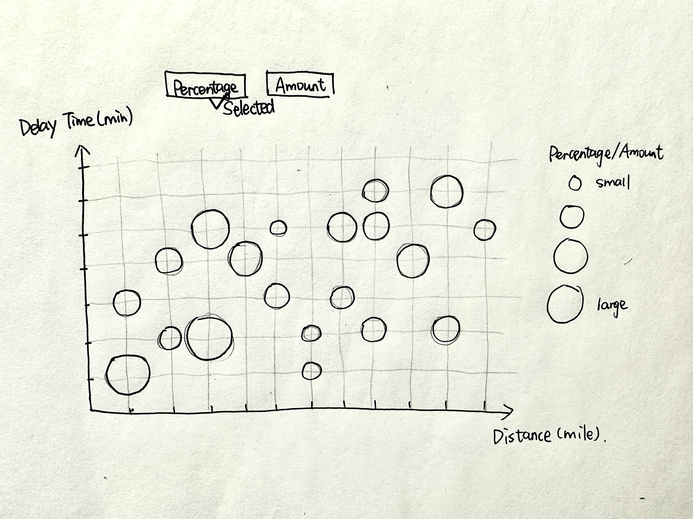

**Flight Destination/Origin**

We would like to sketch a map for identifying the relationship between DEP_DELAY and DEST/ORIGIN.

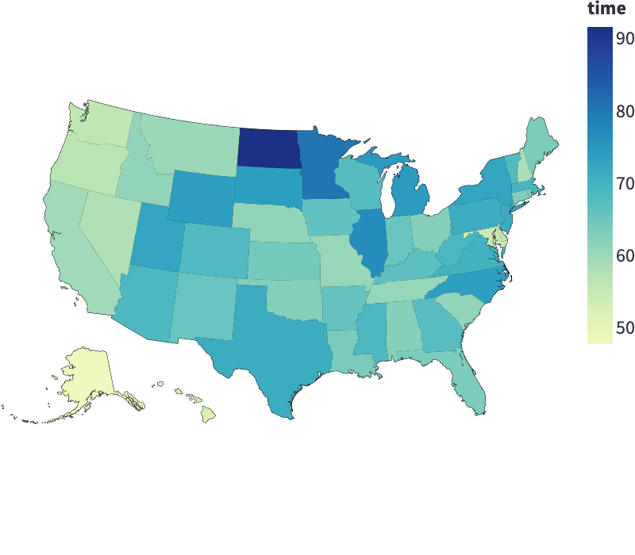

**Integrated chart 1**

Data included: Time Scale, Delay Time, Airline Company(and the number of flights they have), Total Flights, Percentage of Delayed Flights
Users will first select the time scale they would like to inspect. For the given time scale, we would show the distribution of delay time for each month/day. And users could use the bottom chart to further narrow down to the airline they would like to inspect.

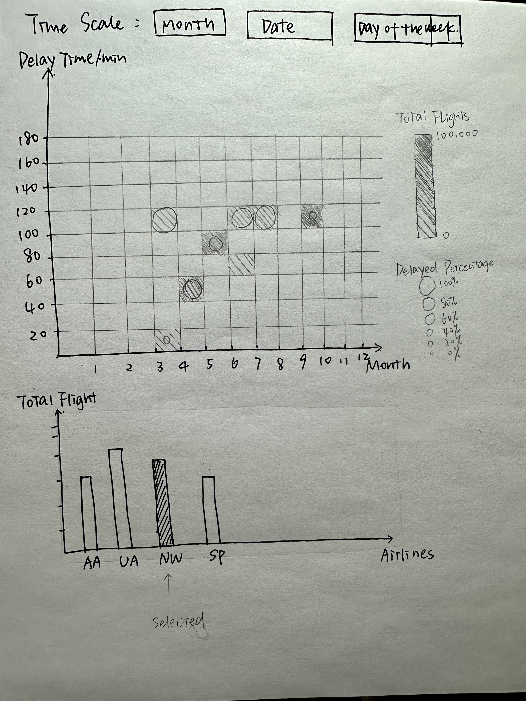

**Integrated chart 2**

Data included: Origin, Destination, Total Flights, Percentage of Delayed Flights
When user hover on one airport, the routes between this airport as the origin to the other destinations will show as rules. The size of the rule indicates the total amount of routes between two airports, and the color of the rule indicates the percentage of delayed flights among all the flights.

#### Prediction
With the insights we get from the previous steps, we would like train a Regression machine learning model that predicts the potential delay time and delay reasons from origin, destination, airline company, departure time.
