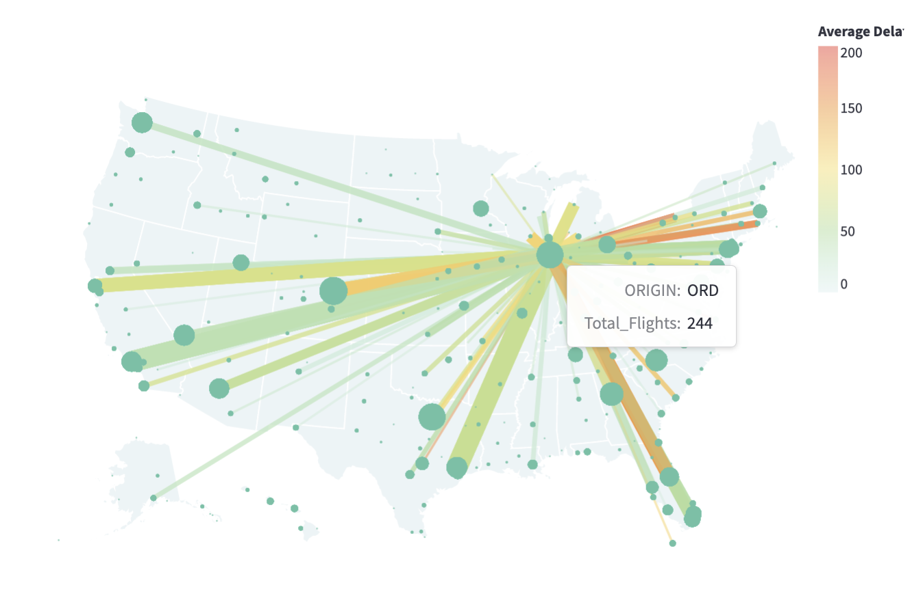

# CMU Interactive Data Science Final Project

* **Online URL**: https://cmu-ids-fall-2022-final-project-flight-never-delay-app-v0b442.streamlit.app/
* **Team members**:
  * Contact person: TODO@andrew.cmu.edu
  * hanxiaoz@andrew.cmu.edu
  * TODO@andrew.cmu.edu
  * TODO@andrew.cmu.edu

**Abstract**: As frequent travelers, our group members often experience flight delays. However, there is no good way for us to know whether a flight will be delayed in advance. In this project, we aim to address this problem by predicting potential flight delays through analyzing past flight delay records. We first perform exploratory data analysis on various factors that may cause flight delays. We lead the user through our analysis with a narrative and several interactive visualizations. Based on our analysis, we recommend travelers to pick airlines companies with better track records such as Alaska Airlines, Southwest Airlines, and Delta Airlines, to be prepared to be delayed when traveling in seasonal peaks such as during the summer or in December, and to transfer through bigger hubs as much as possible, especially more advanced hubs in the West Coast such as Seattle, San Fransico, and Los Angeles. Finally, we offer the user a prediction model that, given flight details, predicts how long a flight may be delayed for and its possible causes.

**Report:** https://github.com/CMU-IDS-Fall-2022/final-project-flight-never-delay/blob/main/Report.md

**Video:**

## Work distribution

Update towards the end of the project.

## Deliverables

### Proposal

- [x] The URL at the top of this readme needs to point to your application online. It should also list the names of the team members.
- [x] A completed [proposal](Proposal.md). Each student should submit the URL that points to this file in their github repo on Canvas.

### Sketches

- [x] Develop sketches/prototype of your project.

### Final deliverables

- [x] All code for the project should be in the repo.
- [x] Update the **Online URL** above to point to your deployed project.
- [x] A detailed [project report](Report.md).  Each student should submit the URL that points to this file in their github repo on Canvas.
- [ ] A 5 minute video demonstration.  Upload the video to this github repo and link to it from your report.
