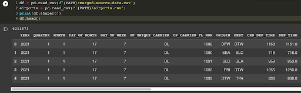
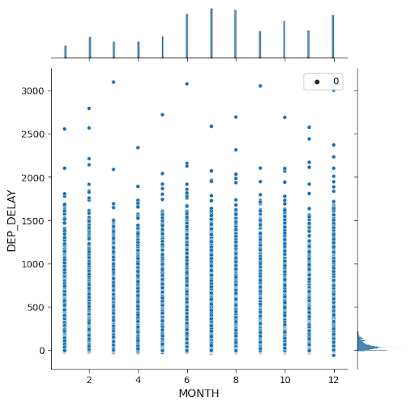
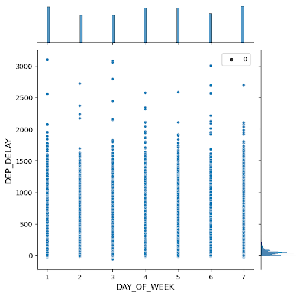
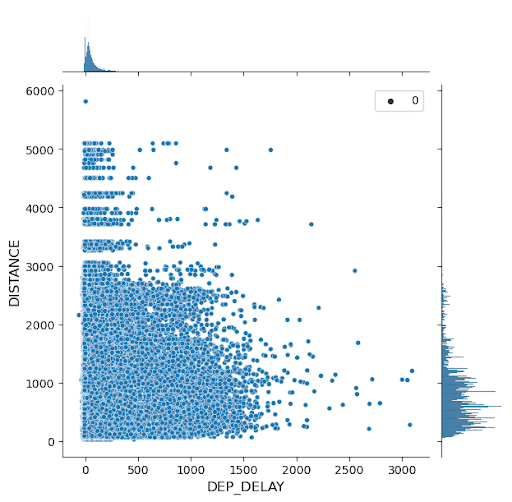
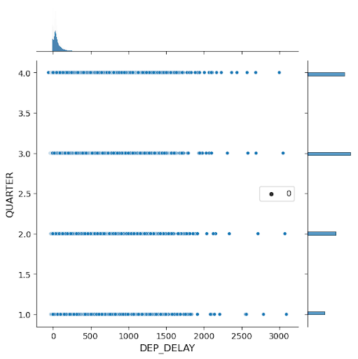

# Final Project Report

**Project URL**: https://cmu-ids-fall-2022-final-project-flight-never-delay-app-v0b442.streamlit.app/

**Video URL**: TODO

Short (~250 words) abstract of the concrete data science problem and how the solutions addresses the problem.

## Introduction
As frequent travelers, our group members often experience flight delays. Flight delays can be heavily disrupted to travel schedules, such as missing important events or having to book extra nights for accomodation. However, this is no good way for us to know whether a flight will be delayed, until at the final moment. In this project, we aim to address this problem by predicting potential flight delays through analyzing past flight delay records. Specifically, we ask the following two questions to guide our exploration:

1. What are the main factors that serve as the causes of flight delays? To answer this question, we perform exploratory data analysis and describe our results through several interactive data visualizations.
2. Given a set of factors, can we predict whether a flight is likely to be delayed? To answer this question, we implement a machine learning model to predict flight delays and possible reasons, given a selection of flight details.

In this report, we give an overview of our dataset, outline how we built our interface, visualizations, and machine learning model, and discuss key findings from our data exploration.

## Related Work

Our project is situated among previous works in visualization flight data and recommender systems with interactive visualizations.

### Visualizing Flight Data

### Recommeder Systems with Interactive Visualizations

## Methods

### Data Processing

#### Data Cleaning and Augmentation

We use a dataset containing flight delay records from the [Bureau of Transportation Statistics - On-Time : Marketing Carrier On-Time Performance](https://www.transtats.bts.gov/DL_SelectFields.aspx?gnoyr_VQ=FGK&QO_fu146_anzr=b0-gvzr). The full dataset is very large (many millions of data points) - spanning from January 2018 to August 2022 with over 100 fields. For the purpose of this project, we select a subset of the data from January 2021 to December 2021 and include only 23 fields. The 23 fields are:
* Time information (YEAR, QUARTER, MONTH, DAY_OF_MONTH, DAY_OF_WEEK) - We include this to uncover correlations between time and flight delays. We also hypothesize that day of the week (e.g. Monday) will influence flight delays.
* Flight carrier (OP_UNIQUE_CARRIER, OP_CARRIER_FL_NUM) - We include this to uncover correlations between flight carriers (e.g. United Airlines) and flight delays.
* Location information (ORIGIN, DEST, DISTANCE) - We include this to uncover correlations between location/distance and flight delays.
* Flight times, delays, and reasons (CRS_DEP_TIME, DEP_TIME, DEP_DELAY, CRS_ARR_TIME, ARR_TIME, ARR_DELAY, CARRIER_DELAY, WEATHER_DELAY, NAS_DELAY, SECURITY_DELAY, LATE_AIRCRAFT_DELAY) - We include this to measure whether a flight is delayed and the degree that it was delayed for. We also include the reasons behind the delays (e.g. weather) to see if they have correlations with other fields (e.g. location).
* Cancellations and reasons (CANCELLED, CANCELLATION_CODE) - Like delays and reasons, we include similar attributes for cancellations.

Our uncleaned dataset contains 6,311,871 data points.

For data cleaning, we first drop duplicates and remove data points that contain empty fields. Then, we separate flights that are delayed and cancelled. For delayed flights, we data points that do not have a delay reason (e.g. one of CARRIER_DELAY, WEATHER_DELAY, NAS_DELAY, SECURITY_DELAY, LATE_AIRCRAFT_DELAY). For canceled flights, we similarly remove data points that do not have a cancellation reason (CANCELLATION_CODE).

We also augment our dataset with more fine-grained geographic information as we would like to create a geographic map to visualize the flight delays. Therefore, we map airport location (ORIGIN, DEST) to US state names and coordinates (latitude and longitude) from a [Kaggle dataset](https://www.kaggle.com/datasets/usdot/flight-delays?select=airports.csv). This adds 6 more fields to our dataset (ORIGIN_STATE, ORIGIN_LAT, ORIGIN_LONG, DEST_STATE, DEST_LAT, DEST_LONG). We remove data points that include airports with unknown geographical locations.

Our final dataset contains 1,141,693 data points with 29 fields.

#### Data Exploration

We explored the relationship between DEP_DELAY and factors including MONTH, DAY_OF_MONTH, DAY_OF_WEEK, OP_UNIQUE_CARRIER, ORIGIN, DEST, DEP_TIME, and DISTANCE.
These explorations provide us with the following inspirations:

* Divide the DEP_DELAY(delay time) into different intervals as there are too many data points, which is hard for us to tell the correlations. 

* Instead of using scatter plots, we probably need to use binned scatter points to better display the distribution of the dataset.

* When exploring relationships between ORIGIN (departure location) and DEP_DELAY, it makes more sense to use a map.

* Meanwhile, we find that aside from the number of flights, the percentage of flights(delayed flights/all flights) is also important, as some big hubs might have more flights and therefore have more delays, but that doesn’t mean you have a higher chance of delay when you depart from this city.

### Interface

We use Streamlit for our interface implementation. Our app is a multipage app containing the Home page, the Prediction page, and the Visualization page. We use [Streamlit Extras](https://github.com/arnaudmiribel/streamlit-extras) to support page switching buttons. We use caching (`@st.cache()`) for intensive operations such as downloading the data file hosted on Google Drive.

#### Home Page

The Home page gives a quick introduction of the project and an overview of the dataset the project is built on. The user may view the full dataset from an expander. In addition, two buttons lead to the other two pages.

#### Prediction Page

The Prediction page allows users to fill in their flight information in a form. The form has various input fields such as an airline selection box, date picker, and text input fields. We have some basic data validation such as checking if the flight number is numeric and whether the arrival and departure airports are different. Based on user-provided details, we predict probabilities that the flight will be delayed or cancelled (see Machine Learning Model section).

#### Visualization Page

The Visualization page presents our data explorations with several interactive data visualizations (see Visualization section and Results section). The user may play around with various input parameters based on their data exploration interests.

### Visualization

We use Altair and Matplotlib for our visualizations implementation. The main challenge we faced when doing visualization was choosing the best charts for our data.

#### Box Plot

We used box plots to show distributions of flight delay values based on airline companies and flight departure time. They can display the five-number summary of a group of data. The five-number summary includes the minimum, first quartile, median, third quartile, and maximum.

#### Binned Scatter Plot

We used binned scatter plots to investigate the relationship between flight delay time and flight distance. The data points in a binned scatter plot are grouped into bins, and an aggregate statistic is used to summarize each bin. For example, we can use a circular area to represent the count and show the density of data points.

#### Map

We used Maps to explore the relationship between flight delay time and geographical features like states or cities. With the map, we can show the delay amount/average time at a give place along with their geographic distribution. 

#### Interactive Chart with Cross-Highlight

The reason we want to show a cross-highlight chart is to tell apart the amount of delay flights and the percentage of delay flights. With higher overall flight amount, there will be more delay flights, but that doesn't mean there is higher chance of delay. So we used the cross-highlight chart to put delay amount & percentage side by side. And we added an interactive bar chart as brush to provide more detailed insight about specfic Airlines.

#### Interactive Chart with Maps & Connections

To provide more detailed insights about the geographical distribution, we used maps with interactive dots to show the connections between places. In this way we can see the delay amount/average time between the origin and destination cities along with their geographic distribution. 

### Machine Learning Model
Linear and logistic regression models are trained to predict the delay time for each reason and the probability of flight cancellation. 

#### Data Preprocessing for ML Models
When training the models, we only kept the flight information accessible to the travelers as the input. Therefore, the inputs include the date, day of the week, scheduled departure time, scheduled arrival time, origin, destination, carrier, and flight number. We performed one-hot encoding on the categorical features such as carrier, origin, and destination. We also standardized the numerical features to allow a better performance for the scikit-learn package.

#### Delay Time Prediction
Five linear regression models were trained to predict the delay time for each of the delay reasons (career, weather, National Airspace System, security, late aircraft). The total delay time is calculated by adding the five predicted delay times together. Mean absolute errors were calculated to evaluate the performance on the validation set. We also explored some shallow neural networks but did not see much performance difference. 

#### Cancellation Probability Prediction
A logistic regression model was trained to predict the possibility of cancellation. The accuracy on the validation set is 91%. The probability is predicted with the predict_proba(X) function in the scikit-learn logistic regression model, which estimate the probability of each label class.

## Results

We studied the relationship between flight delay time and some factors including airline companies, flight departure time, flight distance and flight destination.

### Airline Companies

We firstly compared the delay time based on airline companies in a box plot. The median and the interquartile range in each box well demonstrate the performance of each airline in flight delay. Alaska Airlines, Southwest Airlines and Delta Airlines are the best 3 performers. Some airlines like Skywest Airlines and JetBlue Airlines do need to pay more attention to their flight delay issues.

Based on the box plot, we identified that the delay time could be categorized into <20 minutes, 20-60 minutes, and >60 minutes. If it is smaller than 20, it is approximately on time. If it is between 20 and 60, it is a small delay that most people can tolerate. If it is larger than 60, the flight encounters a serious delay.

With the new categories of delay, it is easy to observe that the proportion of delays varies from airline to airline. Some airlines like JetBlue Airlines behave badly. They have a relatively low on-time rate and a relatively high large delay rate. Although SouthWest Airlines has the largest number of flight delays, these delays are mainly small delays and the company maintains a pretty good on-time rate.

To sum up, airline companies behave very much differently in dealing with flight delay problems. It is safe to deduce that choosing an airline company would influence flight delay.

### Flight Departure Time

We then sketched another box plot to study the distributions of flight delay time values based on flight departure time (Quarter / Month / Day of Week). It can be observed that: (1) a long flight delay is more likely to happen in Quarter 2 & 3 than in Quarter 1 & 4; (2) it is more likely to encounter a flight delay on Monday.

To sum up, flight time is also an important factor leading to flight delay. Long flight delays are more likely to happen during the summer or on Monday.

### Flight Distance

We then drew a binned scattered plot to identify the relationship between delay time and flight distance. The data points in the plot are grouped into bins with a circle in each bin to represent the amount of flights in that bin and its percentage to the total number of flights.

It can be seen in the plot that flight distance seems not to be a key factor to delay time.

### Flight Destination

We are also interested the relationship between the delay time and destination. We want to see whether there are some destinations that are likely to delay longer time than other places. The data points in the plot are grouped into states. We caluculated the average delay time for the flights that arrives at each state.to avoid the impact of extreme data points, we only take delay times that are under 400 mins.

We can see if you are planning to go to the north eastern part of the country, the flights might delay longer.

### Flight Origin

Same as the previous one, we also want to see relationship between the delay time and origins.

We can see from the map that if you departure from several states in the middle US (like North Dakota, Wyoming or Mississipi)you might delay for longer time.

### Flight Distribution Over Time

To further discuss the relationship between delay time and different timestamp, we take a look at the delay time. The color indicates the number of flights with the delay time (y-axis) on the given time categoary (x-axis) for a selected time scale. The size of circle indicates the percentage (likelihood) of a delay time occured on each time categoary. Randomly sample 5000 from the data for efficient computation purpose.

If we choose quarter at the above chart, we can see that quarter 3 has the most number of flights thats delay under 40 mins, it seems that quarter 3 might be a good choice to fly. But if we take a look at the percentage(likelyhood) of a delay time happend in each quarter, we can see that quarter 1 actually has the highest percentage of flights that delay under 40 mins, which means, if you travel in quarter 1, you'll have higher chance to delay for a little while. Likewise, we can also see March and Wednesday has the lowest chances of delay higher than 40. These time might be the better choice for flying.

We could also spect the distribution for specfic airlines. Take American Airline (AA) as an example, we can see Wednesday has most flights and lowest delay rate, which makes Wednesday a best choice for AA. Similar ideas can be applied to quarters and months.

### Flight Delay Distribution over Origin and Destination
Finally, we want to see whether there are some specific routes between cities are especially likely to delay. The circle indicate the number of flights departed from this airport. We can see there are some larger airport hub where the circles are larger. If we hover on one airport, we can see all the routes that departs from this airport. The width of the connection indicates the number of flights between the two airports and the color of the edge indicates the average delay time between the two airports.

Let's take Chicago ORD airport as an example. We can see it has most frequent flights to Los Angles, and the delay time is relatively low. However if you go to Rhode Island from Chicago, there will be less flights options and there are higher chances for delay.

P.S. We randomly sampled 5000 from the dataset for efficient computation purpose.
## Discussion

## Future Work
